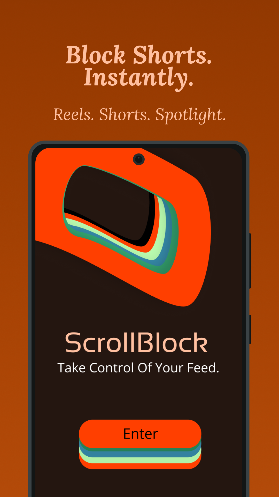
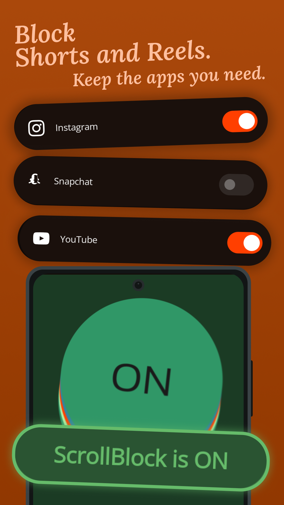
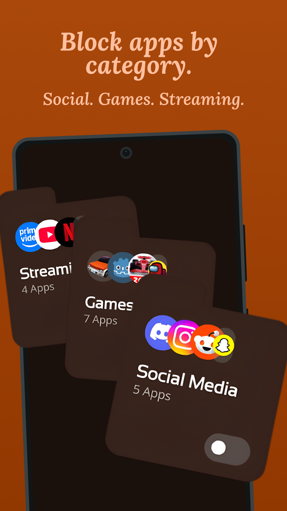
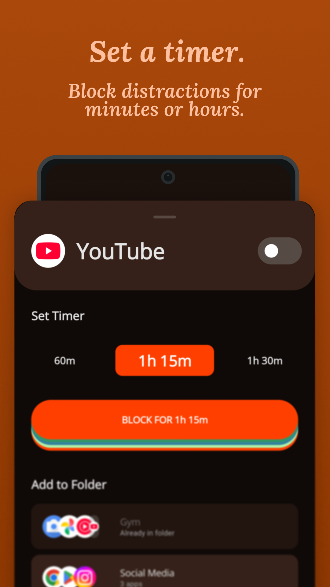
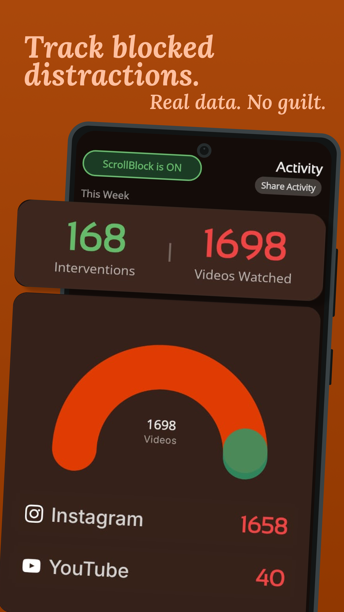
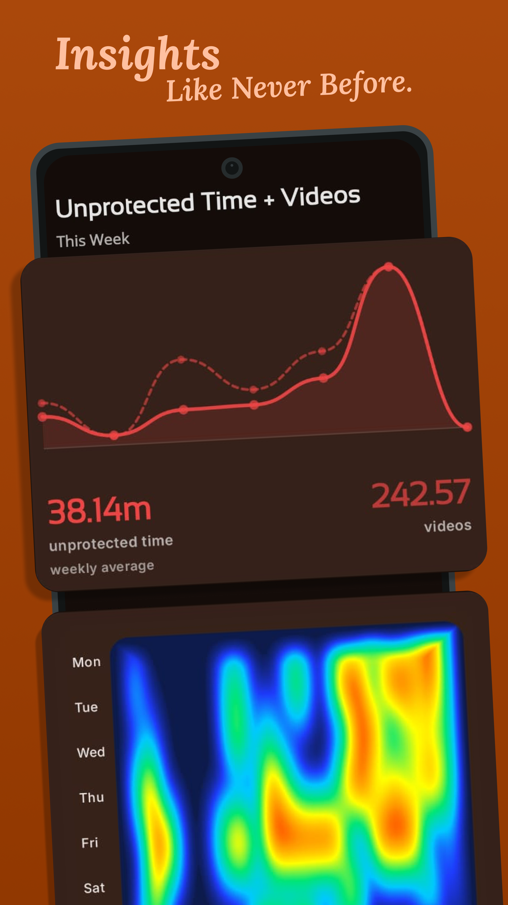
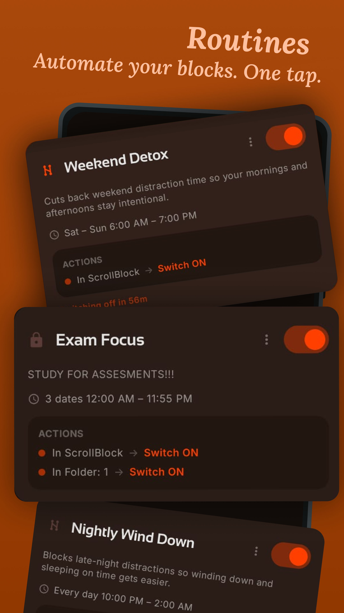
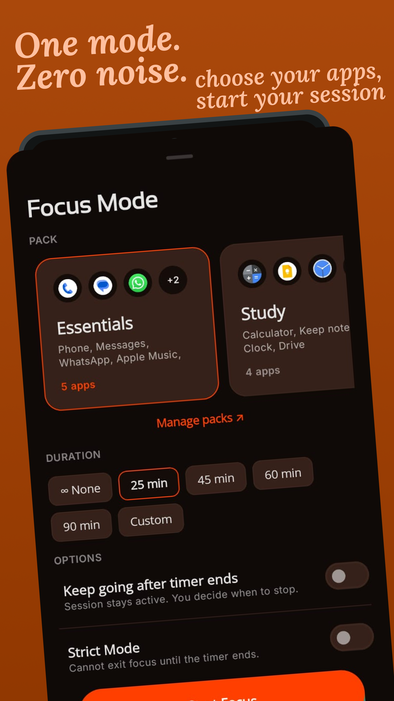
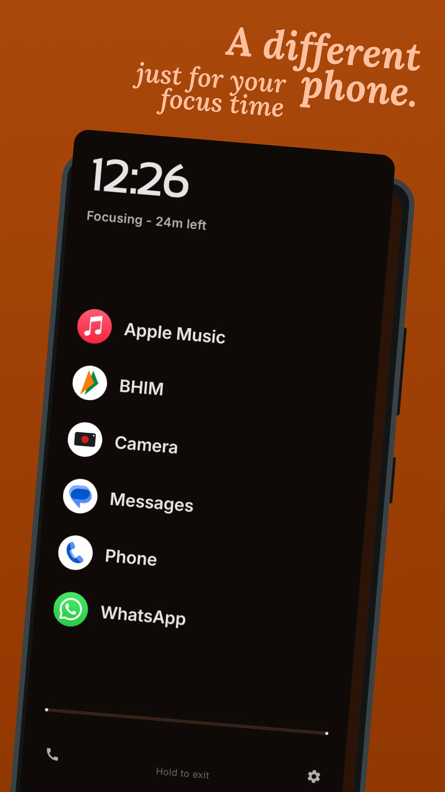

  

<h1 align="center">ScrollBlock</h1>

  <strong>Take back your attention. Defeat the doomscrolling loop.</strong>

  

  
  
  
  

---

## What is ScrollBlock?

**ScrollBlock** is a premium, offline-first digital wellbeing utility for Android designed to break the psychological loop of short-form video feeds. 

Unlike general app blockers that force-close apps or lock you out of entire platforms, ScrollBlock targets the **exact feeds designed to trap your attention**—including Instagram Reels, YouTube Shorts, Snapchat Spotlight, YouTube Music Samples, and X (Twitter) Immersive Videos—while leaving standard features like messaging and feeds completely accessible.

ScrollBlock is **100% ad-free, runs entirely offline on your device, and collects zero personal data.**

  
  
  

---

## 🌟 Key Features

| Feature | Description |
| :--- | :--- |
| 🛡️ **Active Feeds Blocker** | Instantly exits Reels, Shorts, Spotlight, and Samples the millisecond they are opened. Uses non-destructive navigation (simulates a "Back" press) to return you to safety without crashing the app. |
| ⏳ **Mindful Scroll Pass** | Need to check something intentional? Grant yourself a 5, 10, or 15-minute pass. Once the timer expires, ScrollBlock automatically re-enables protection behind the scenes. |
| 🎯 **Strict Focus Launcher** | Lock distracting apps behind a minimalist screen. Overrides your default launcher to display only pre-selected, productivity-enhancing apps. |
| 📅 **Scheduled Routines** | Automate your willpower. Schedule custom blocking windows during study, work, morning routines, or bedtime. |
| 📂 **Folder-Based App Locking** | Organize games, shopping, or social apps into custom folders. Protect them with password locks, daily usage quotas, or total block windows. |
| 📊 **Advanced Habit Analytics** | Dive into detailed activity logs. Monitor how many times ScrollBlock intercepted a scroll, check historical trends, and track your daily "Time Saved" estimates. |
| 📱 **Launcher Widgets** | Control protection state instantly with one-tap main toggles, and view active streaks or focus stats directly on your home screen. |

  
  
  

---

## 📱 Supported Platforms

ScrollBlock actively monitors and blocks short-form autoplaying feeds in:
*   **Instagram**: Reels feeds, full-screen reels players, and infinite scroll (includes an optional **DM-Only Mode**).
*   **YouTube**: Shorts player and Shorts feeds.
*   **YouTube Music**: Samples discovery feed.
*   **Snapchat**: Spotlight feed.
*   **X (Twitter)**: Immersive video reels.

---

## 🔒 Privacy & Safety First

Accessibility-based tools often raise privacy questions. ScrollBlock is designed with a strict **no-data-collection architecture**:

*   **100% Offline operation**: The app does not request internet permissions for its blocking engine. Your scrolling behavior, stats, and logs never leave your device.
*   **Zero Data Extraction**: ScrollBlock uses the Android Accessibility Service API solely to inspect UI window properties (e.g., node resource IDs) and perform navigation commands (`GLOBAL_ACTION_BACK`). It cannot read your personal chats, posts, search queries, or login credentials.
*   **Local Backups**: Keep your data safe with manual or scheduled backups. Export them to your device storage or link your Google Drive for private cloud backups (managed entirely through secure Google account tokens).

---

## ⚙️ How It Works Under the Hood

1.  **Accessibility Monitoring**: When you open a supported app, ScrollBlock's background service receives standard UI accessibility events (window changes, scrolls, and clicks).
2.  **Signature Match**: The high-precision detection engine (`ReelsDetector`, `ShortsDetector`, etc.) checks if the current screen corresponds to a short-form video container.
3.  **Non-Intrusive Intervention**: Rather than killing the app process, ScrollBlock instantly performs a system-level "Back" action. You are seamlessly returned to your previous context (such as the main feed or a chat thread) without frustrating app restarts.
4.  **OS Optimization Recovery**: Aggressive battery-saving features on modern phones (especially MIUI/HyperOS, OnePlus, and Samsung) can sometimes kill accessibility services. ScrollBlock includes a built-in recovery sheet and autostart guidance to keep your protection running stably.

  
  
  

---

## 🧑‍💻 A Note from the Developer

> *"Hi, I'm Naresh. I'm a 20-year-old undergraduate student still figuring life out.*
>
> *I HATE ads, noisy apps, and software with poor design taste. I wanted ScrollBlock to feel different: useful, focused, personal, and built with enough care that I could actually be proud of it. I've spent months perfecting a clean, premium, brown-toned design that respects your attention.*
>
> *If you choose to support ScrollBlock through a Premium subscription or the Lifetime plan, thank you so much. You're helping an independent student keep improving this utility, experiment with better ideas, and build software that respects people's time."*

---

## 📥 Download

### Google Play Store
Get automated updates, easy backups, and secure subscription management directly on Google Play:
👉 **[Download ScrollBlock on Google Play Store](https://play.google.com/store/apps/details?id=dev.naresh.scrollblock)**

---

## 📄 Documentation & Policies

*   [Privacy Policy](PRIVACY_POLICY.md)
*   [Developer Guidelines & Code Rules](DEVELOPER.md)

---

## ✉️ Support & Feedback

If you would like to report a bug, request a new feature, or submit feedback:
*   **Raise a GitHub Issue**: [Open a support or request issue on GitHub](https://github.com/nareshkarthigeyan/ScrollBlock/issues) for bugs and features.
*   **Email Support**: Email direct to [work.nareshkarthigeyan@gmail.com](mailto:work.nareshkarthigeyan@gmail.com).
*   **In-App Support**: Report issues directly within ScrollBlock via the **About** menu (which packages helpful diagnostic data for faster support).

## Star History

<picture>
  <source media="(prefers-color-scheme: dark)" srcset="https://api.star-history.com/chart?repos=nareshkarthigeyan/ScrollBlock&type=date&theme=dark&legend=top-left" />
  <source media="(prefers-color-scheme: light)" srcset="https://api.star-history.com/chart?repos=nareshkarthigeyan/ScrollBlock&type=date&legend=top-left" />
  
</picture>
